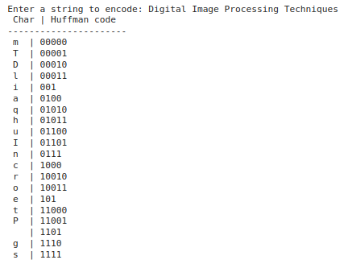

# Huffman-Coding
## Aim
To implement Huffman coding to compress the data using Python.

## Software Required
1. Anaconda - Python 3.7

## Algorithm:

### Step1:
- **Calculate the frequency of each character** in the input string.

### Step2:
- **Create a priority queue (min-heap)** to store nodes based on character frequencies.

### Step3:
- **Build the Huffman tree** by repeatedly combining the two nodes with the lowest frequencies until only one node remains.

### Step4:
- **Generate the Huffman codes** by traversing the tree and assigning binary codes ('0' for left, '1' for right).

### Step5:
- **Print the Huffman codes** for each character in the input string.
 
## Program:
```md
Name    : Sam Israel D
Reg. No : 212222230128
```
``` Python
import heapq
from collections import defaultdict

# Step 1: Get the input String
string = input("Enter a string to encode: ")

# Step 2: Create tree nodes
class NodeTree(object):
    def __init__(self, char, freq):
        self.char = char  # Character in the input string
        self.freq = freq  # Frequency of the character
        self.left = None   # Left child
        self.right = None  # Right child

    def __lt__(self, other):
        # Ensure the priority queue (heap) orders by frequency
        return self.freq < other.freq
```
```python
# Step 3: Main function to implement Huffman coding
def huffman_code_tree(node, left=True, binString=''):
    if node is None:
        return {}
    
    # If this is a leaf node, return the character with its binary code
    if node.char is not None:
        return {node.char: binString}
    
    # Recur for left and right children and concatenate the result
    huffman_codes = {}
    huffman_codes.update(huffman_code_tree(node.left, left=True, binString=binString + '0'))
    huffman_codes.update(huffman_code_tree(node.right, left=False, binString=binString + '1'))
    
    return huffman_codes

# Step 4: Calculate frequency of occurrence
freq = defaultdict(int)
for char in string:
    freq[char] += 1

# Step 5: Create a priority queue (min-heap) of nodes based on frequency
heap = []
for char, freq_value in freq.items():
    heapq.heappush(heap, NodeTree(char, freq_value))

# Step 6: Build the Huffman Tree
while len(heap) > 1:
    # Pop two nodes with the lowest frequency
    left = heapq.heappop(heap)
    right = heapq.heappop(heap)

    # Create a new internal node with these two nodes as children
    merged = NodeTree(None, left.freq + right.freq)
    merged.left = left
    merged.right = right

    # Push the internal node back into the heap
    heapq.heappush(heap, merged)

# The remaining node is the root of the Huffman Tree
root = heap[0]

# Step 7: Get the Huffman codes by traversing the Huffman tree
huffmanCode = huffman_code_tree(root)

# Step 8: Print the characters and their Huffman codes
print(" Char | Huffman code ")
print("----------------------")
for char, code in huffmanCode.items():
    print(f" {char}  | {code}")
```
## Output:

### Print the characters and its huffmancode



## Result
Thus the huffman coding was implemented to compress the data using python programming.
